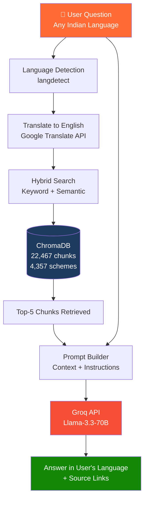

# 🏛️ YojanaGPT

<div align="center">

**AI-powered assistant for Indian government schemes — in any of 22 Indian languages**

[](https://python.org)
[](https://fastapi.tiangolo.com)
[](https://www.trychroma.com)
[](https://groq.com)
[](https://huggingface.co/spaces)
[](LICENSE)
[](tests/)
[](https://en.wikipedia.org/wiki/Eighth_Schedule_to_the_Constitution_of_India)

<br/>

*किसी भी सरकारी योजना के बारे में किसी भी भाषा में पूछें*
*Ask about any government scheme in any Indian language — for free, with zero personal data required*

[🚀 Live Demo](https://adi12340-yojanagpt.hf.space/ui) · [📖 API Docs](http://localhost:8000/docs) · [🐛 Report Bug](https://github.com/Aditya9122002/yojanagpt/issues) · [💡 Request Feature](https://github.com/Aditya9122002/yojanagpt/issues)

</div>

---

## 📸 Screenshots

<!-- PLACEHOLDER: Add screenshot of main chat UI -->
> **Main Chat Interface**
> 
> *Ask questions in Hindi, Tamil, Bengali or any Indian language*

<!-- PLACEHOLDER: Add screenshot of eligibility checker -->
> **Eligibility Checker**
> 
> *Fill your profile and get personalised scheme recommendations*

<!-- PLACEHOLDER: Add screenshot of document checklist -->
> **Document Checklist**
> 
> *Get a complete numbered checklist of documents required to apply*

---

## 🎯 The Problem

India has **4,600+ central government schemes** worth lakhs of crores — but most eligible citizens never access them because:

- 📄 Information is scattered across dozens of government portals
- 🗣️ Almost all content is in English only
- 🧭 Application processes are complex and unclear
- 📞 Helpline numbers are hard to find

**YojanaGPT fixes this.** Any citizen can now ask about any scheme in their own language and get accurate, grounded answers in seconds.

---

## ✨ Features

| Feature | Description |
|---|---|
| 💬 **Ask anything** | General Q&A about any of 4,357 schemes |
| ✅ **Eligibility checker** | Fill your profile → get personalised scheme matches |
| 📋 **Document checklist** | Complete list of documents needed to apply |
| 📝 **Step-by-step guide** | Online/offline application steps with portal links |
| ⚖️ **Scheme comparison** | Side-by-side comparison of 2+ schemes |
| 📞 **Helpline finder** | Toll-free numbers, emails, grievance portals |
| 🌐 **22 Indian languages** | Hindi, Tamil, Bengali, Telugu, Marathi, Gujarati, Kannada, Malayalam, Punjabi, Odia, Urdu + more |
| 🔒 **Zero personal data** | No login, no tracking, no data stored |

---

## 🏗️ Architecture



### Data Pipeline


---

## 🛠️ Tech Stack

| Layer | Technology | Why |
|---|---|---|
| **LLM** | Llama-3.3-70B via Groq | Free tier (14,400 req/day), fast inference, strong multilingual support |
| **Embeddings** | `paraphrase-multilingual-MiniLM-L12-v2` | Multilingual sentence embeddings, runs on CPU |
| **Vector DB** | ChromaDB | Local, persistent, no infra needed |
| **Search** | Hybrid (keyword + semantic) | Better recall than either alone |
| **Translation** | Google Translate (deep-translator) | Fast, free, supports all 22 Indian languages |
| **Language detection** | langdetect | Lightweight, accurate for Indian scripts |
| **API** | FastAPI + Uvicorn | Fast, async, auto-docs |
| **Frontend** | Vanilla HTML/CSS/JS | Zero dependencies, works offline |
| **CI/CD** | GitHub Actions | 69 tests run on every push |
| **Deployment** | HuggingFace Spaces + Docker | Free GPU/CPU hosting |

---

## 📁 Project Structure

```
yojanagpt/
├── .env                          # GROQ_API_KEY (not committed)
├── .github/workflows/            # CI/CD — GitHub Actions
├── Dockerfile                    # Container for HF Spaces
├── docker-compose.yml
├── requirements.txt
├── frontend/
│   └── index.html               # Chat UI (bilingual Hindi + English)
├── src/
│   ├── scraper/                 # Scrapes myscheme.gov.in API
│   │   ├── client.py            # HTTP client
│   │   ├── parser.py            # JSON → Python models
│   │   ├── models.py            # Pydantic scheme models
│   │   ├── scraper.py           # Orchestrator
│   │   └── cli.py               # python -m src.scraper.cli
│   ├── ingestion/               # Chunks + embeds schemes → ChromaDB
│   │   ├── chunker.py           # Splits schemes into typed chunks
│   │   ├── embedder.py          # Generates sentence embeddings
│   │   ├── vectorstore.py       # ChromaDB read/write
│   │   ├── pipeline.py          # End-to-end ingestion
│   │   └── cli.py
│   ├── retrieval/               # RAG pipeline
│   │   ├── retriever.py         # Hybrid search (keyword + semantic)
│   │   ├── prompt.py            # 6 prompt builders
│   │   ├── llm.py               # Groq API client
│   │   ├── pipeline.py          # Full RAG orchestration
│   │   └── cli.py
│   ├── translation/             # Multilingual layer
│   │   ├── detector.py          # Language detection
│   │   └── translator.py        # English ↔ Indian languages
│   └── api/                     # FastAPI app
│       ├── main.py              # 6 routes
│       ├── models.py            # Pydantic request/response models
│       └── deps.py              # Dependency injection (pipeline)
├── data/
│   ├── raw/                     # Scraped JSON (not committed)
│   └── chromadb/                # Vector DB (not committed)
└── tests/
    └── unit/
        ├── test_parser.py
        ├── test_chunker.py
        └── test_vectorstore.py
```

---

## 🚀 Quick Start

### Prerequisites

- Python 3.11+
- A free [Groq API key](https://console.groq.com) (14,400 requests/day free)

### 1. Clone the repo

```bash
git clone https://github.com/Aditya9122002/yojanagpt.git
cd yojanagpt
```

### 2. Create virtual environment

```bash
python -m venv .venv

# Windows
.venv\Scripts\activate

# macOS / Linux
source .venv/bin/activate
```

### 3. Install dependencies

```bash
pip install -r requirements.txt
```

### 4. Set up environment variables

```bash
# Create .env file
echo "GROQ_API_KEY=your_key_here" > .env
```

Get your free Groq key at [console.groq.com](https://console.groq.com)

### 5. (Optional) Ingest schemes into ChromaDB

> Skip this if you already have `data/chromadb/` from a previous run.

```bash
# Test scraper (scrapes 5 schemes)
python -m src.scraper.cli --test

# Test ingestion (ingests 5 schemes)
python -m src.ingestion.cli ingest --test

# Full ingestion (all 4,357 schemes — takes ~30 min)
python -m src.ingestion.cli ingest
```

### 6. Start the API

```bash
uvicorn src.api.main:app --host 0.0.0.0 --port 8000
```

### 7. Open the frontend

Open `frontend/index.html` in your browser. That's it — you're running YojanaGPT locally.

---

## 🔌 API Reference

Base URL: `http://localhost:8000`

| Method | Endpoint | Description |
|---|---|---|
| `GET` | `/` | API info and available endpoints |
| `GET` | `/health` | Health check + DB stats |
| `POST` | `/ask` | General scheme Q&A |
| `POST` | `/eligibility` | Eligibility check with user profile |
| `POST` | `/documents` | Document checklist for a scheme |
| `POST` | `/apply` | Step-by-step application guide |
| `POST` | `/compare` | Side-by-side scheme comparison |
| `POST` | `/contact` | Helpline numbers and contact details |

Full interactive docs: `http://localhost:8000/docs`

### Example requests

**Ask a question in Hindi:**
```bash
curl -X POST http://localhost:8000/ask \
  -H "Content-Type: application/json" \
  -d '{"question": "PM Kisan ke liye kaun eligible hai?"}'
```

**Check eligibility:**
```bash
curl -X POST http://localhost:8000/eligibility \
  -H "Content-Type: application/json" \
  -d '{
    "question": "Which schemes am I eligible for?",
    "profile": {
      "age": "35",
      "state": "Maharashtra",
      "caste": "OBC",
      "income": "120000",
      "occupation": "Farmer"
    }
  }'
```

**Compare schemes:**
```bash
curl -X POST http://localhost:8000/compare \
  -H "Content-Type: application/json" \
  -d '{
    "question": "Compare PM Kisan and PMFBY",
    "scheme_names": ["PM Kisan", "PMFBY"]
  }'
```

**Response format (all endpoints):**
```json
{
  "answer": "PM Kisan Samman Nidhi ke liye...",
  "detected_language": "hi",
  "language_name": "Hindi",
  "sources": [
    {
      "scheme_id": "pmkisan",
      "scheme_name": "PM Kisan Samman Nidhi",
      "source_url": "https://myscheme.gov.in/schemes/pmkisan"
    }
  ],
  "chunks_retrieved": 5
}
```

---

## 🧪 Running Tests

```bash
# Run all tests
pytest tests/ -v

# Run specific test file
pytest tests/unit/test_parser.py -v

# Run with coverage
pytest tests/ --cov=src --cov-report=term-missing
```

**69 tests** covering parser, chunker, and vector store.

---

## 🐳 Docker

```bash
# Build and run
docker-compose up --build

# API will be available at http://localhost:8000
```

---

## 🌐 Supported Languages

All 22 languages in the 8th Schedule of the Indian Constitution:

| | | | |
|---|---|---|---|
| हिंदी Hindi | বাংলা Bengali | తెలుగు Telugu | मराठी Marathi |
| தமிழ் Tamil | اردو Urdu | ગુજરાતી Gujarati | ಕನ್ನಡ Kannada |
| മലയാളം Malayalam | ਪੰਜਾਬੀ Punjabi | ଓଡ଼ିଆ Odia | অসমীয়া Assamese |
| मैथिली Maithili | संस्कृत Sanskrit | संथाली Santali | کٲشُر Kashmiri |
| नेपाली Nepali | सिन्धी Sindhi | कोंकणी Konkani | डोगरी Dogri |
| মণিপুরী Manipuri | बड़ो Bodo | | + English |

---

## 🗺️ Roadmap

- [x] Web scraper for myscheme.gov.in
- [x] Multilingual chunking and embedding pipeline
- [x] Hybrid search (keyword + semantic)
- [x] FastAPI with 6 specialized endpoints
- [x] Bilingual chat UI (Hindi + English)
- [x] 22 Indian language support
- [x] GitHub Actions CI/CD (69 tests)
- [ ] HuggingFace Spaces deployment
- [ ] Voice input (IndicASR)
- [ ] Text-to-speech output (AI4Bharat TTS)
- [ ] MLflow experiment tracking
- [ ] MeitY / Bhashini submission

---

## 🤝 Contributing

Contributions are welcome! This is an open-source civic tech project.

```bash
# Fork the repo, then:
git checkout -b feature/your-feature
git commit -m "Add: your feature description"
git push origin feature/your-feature
# Open a Pull Request
```

Areas where help is especially welcome:
- Adding more scheme data sources
- Improving retrieval accuracy
- Better support for regional language scripts
- Voice input/output integration

---

## 📄 License

MIT License — see [LICENSE](LICENSE) for details.

---

## 🙏 Acknowledgements

- [myscheme.gov.in](https://myscheme.gov.in) — Government of India scheme data
- [Groq](https://groq.com) — Free LLM inference API
- [ChromaDB](https://www.trychroma.com) — Vector database
- [AI4Bharat](https://ai4bharat.iitm.ac.in) — Inspiration for Indian language AI
- [Sarvam AI](https://sarvam.ai) — Indian language AI research

---

<div align="center">

Built with ❤️ for 1.4 billion Indians · **YojanaGPT** · [GitHub](https://github.com/Aditya9122002/yojanagpt)

*Not affiliated with the Government of India*

</div>